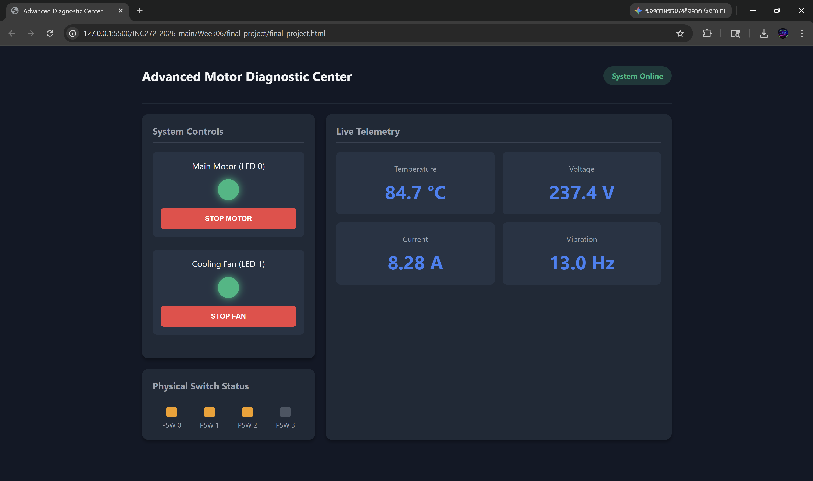

# Advanced Motor Diagnostic Center

* * *

## Group Information

| | |
|---|---|
| Group name | TNT |
| Member 1 | Nattakorn Limpanarom — 67070504005 |
| Member 2 | Bhavornnan Kengkarnchang — 67070504006 |
| Member 3 | Pongsapak Nonkhum — 67070504024 |
| Course | INC272: Web-Based IoT Applications (2026) |

* * *

## Project Goal

A comprehensive, browser-based Human-Machine Interface (HMI) designed to monitor the health of an industrial synchronous motor and provide remote operational control over its motor and cooling systems.

* * *

## Simulator Features Used

- [x] LED — 4 channels, toggle on/off
- [x] PSW — 4 push switches, read state
- [x] ADC — 4 analog channels, read sensor values
- [ ] PWM — 4 channels, control duty ratio

* * *

## Interface Features

### Monitoring Elements

| Element | What It Shows | Simulator Feature |
|---------|--------------|-------------------|
| Temperature Display | Scaled reading of system temperature (20-90°C) | ADC ch.0 |
| Voltage Display | Scaled reading of system voltage (220-240V) | ADC ch.1 |
| Current Display | Scaled reading of current draw (0-15A) | ADC ch.2 |
| Vibration Display | Scaled reading of motor vibration (0-60Hz) | ADC ch.3 |
| Hardware Switch Indicators | Live hardware switch press states | PSW ch.0, 1, 2, 3 |

### Control Elements

| Element | What It Does | Command Sent |
|---------|-------------|--------------|
| Motor Toggle Button | Turns the Main Motor (LED 0) on or off | `led,0,2` |
| Fan Toggle Button | Turns the Cooling Fan (LED 1) on or off | `led,1,2` |

* * *

## How to Run

1. Start the mock hardware server:
    ```bash
   cd simulator/mock-hardware-server
   npm install
   npm start
3. Open index.html using a modern browser or VS Code Live Server.
4. Check the browser console — a WebSocket connection message should appear.
5. Check the server terminal — [CONNECT] should be printed, and telemetry will start broadcasting.

***

## File Structure
    final_project/
     ├── final_project.html      — main HTML layout using CSS grid
     ├── final_project.css       — custom interface styling and visual feedback
     ├── final_projectt.js         — WebSocket logic, data parsing, and scaling functions
     └── README.md       — project documentation

***

## Known Limitations

None. The system perfectly maintains a real-time connection and seamlessly routes multi-channel telemetry and control signals.

***

## Screenshots



***
